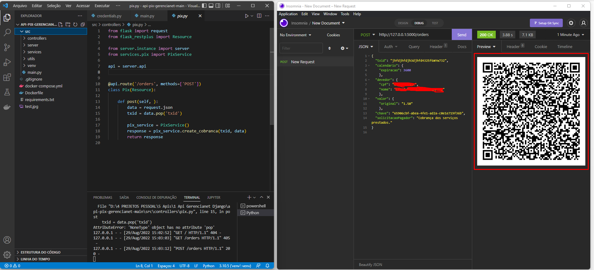

# QRCODE PIX | BANCO GERENCIANET

# Api para gerar QRCode de pagamento via pix, do banco gerencianet.

**INSTALE TODAS AS CREDENCIAIS, ABRA O INSOMINIA OU O ARQUIVO, consume_api.py E FAÇA UMA REQUISIÇÃO PARA GERAR O QRCODE.**
**LEMBRANDO QUE VOCE TERÁ QUE ATERAR O TXID A CADA REQUISICAO, CASO CONTRARIO VAI DAR ERRO DEVIDO A ISSO. E LEMBRE-SE DE ADICIONAR SUA CHAVE PIX NO CAMPO "CHAVE"**

~~~shell
pip install -r requirements.txt
~~~

**REQUISIÇÃO DEVE SER FEITA PARA `http://127.0.0.1:8000/orders` COMO MOSTRADO NA IMAGEM**

~~~shell
{
  "txid": "jhfdjhfdjh3djhfd4322ffmYw73v",
  "calendario": {
    "expiracao": 3600 
    },
  "devedor": {
    "cpf": "07492",
    "nome": "LUCAS DA SILVA"
    },
  "valor": {
    "original": "1.50"
    },
  "chave": "65906cbf-abea-4fe1-ad2a-c0e1e719f36b",
  "solicitacaoPagador": "Cobrança dos serviços prestados."
}
~~~

